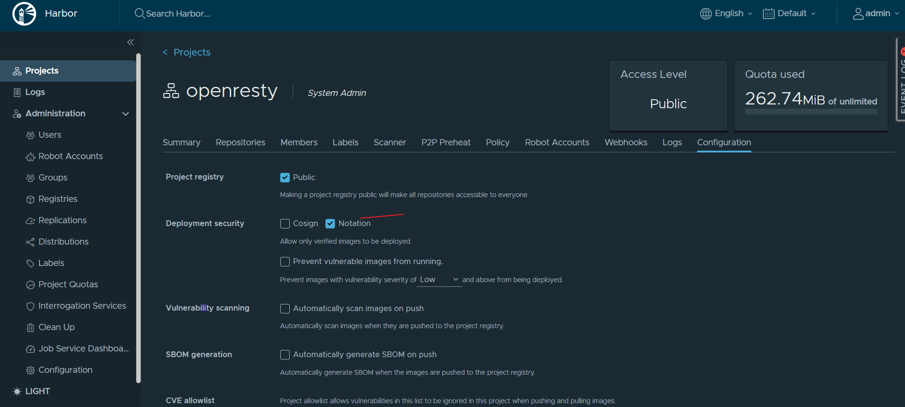

## Harbor

###### Pull
- The image is not signed by notation.
```
curl -H "Authorization: Bearer robot-name" \
     -H "Accept: application/vnd.docker.distribution.manifest.v2+json" \
     "https://registry.shao.sh/v2/openresty/openresty/manifests/1.27.1.1-0-noble"
```
output
```
{"errors":[{"code":"PROJECTPOLICYVIOLATION","message":"The image is not signed by notation."}]}
```
通过比较,发现新建项目后会自动enable notation , disable it, 所有问题解决
