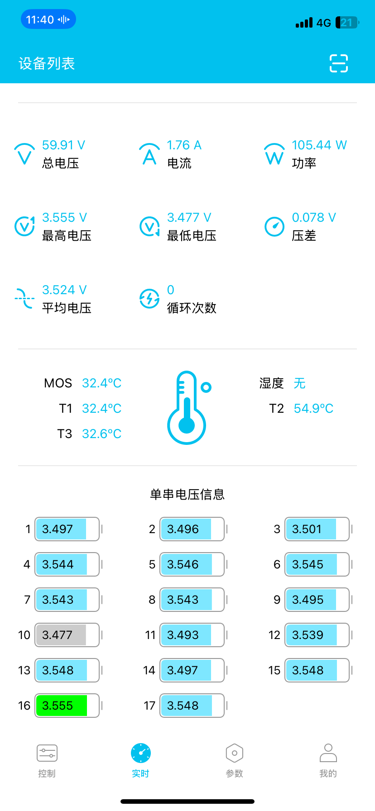

# 锂电池
## BWS-4850-SY,无保护板,维护记录
- 2025-7-31, 3.96/4.00V
## BWS-48100-ATL,无保护板,维护记录
- 2025-7-31, 3.98/4.00V
## 4810-EVE-50A
- 48V9AH, 亿纬5000 21700, 嘉佰达50A保护板
- 欠压保护44V 2025-07-31

## 4820-EVE-30A
- 48V20AH, 亿纬5000 21700, 嘉佰达50A保护板
- 近欠压保护42V 2025-07-31

## AM-6020-EVE-40A
- 60V20AH, 亿纬5000 21700, 嘉佰达40A保护板
- 欠压保护55V 2025-08-01

- 近欠压保护55V 2025-08-01

## AM-6020-FST-40A
- 60V20AH, 福斯特2500 18650, 嘉佰达40A保护板
- 近欠压保护59V 2025-08-01
