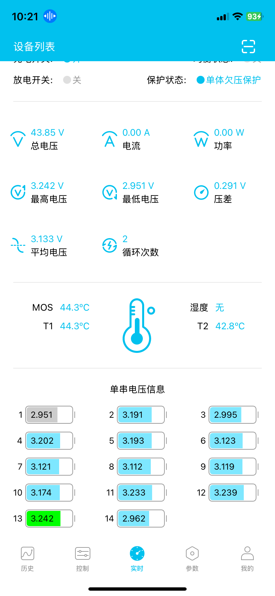

# 锂电池
## 可用缩放图片技巧
`````` (1)
{ .annotate }

1. ``` {width="200px" align=left} ```

video20250809074528
video20250808075542

## BWS-4850-SY,无保护板,维护记录
- 2025-7-31, 3.96/4.00V

## BWS-48100-ATL,无保护板,维护记录
- 2025-7-31, 3.98/4.00V

## DY-1230-GX-50A,保护板,维护记录
- 2025-7-25, 4节国轩磷酸铁锂30AH串联, 270WH, 21.09AH/节, 18+30=48元, 178元/KWH

## DY-12140-ND-50A,保护板,维护记录
- 2025-7-25, 4节宁德磷酸铁锂86AH串联,922WH, 72AH/节, 62+54*3=222元, 241元/KWH1 

## DY-12140-ND-50A,保护板,维护记录
- 2025-8-4, 4节宁德磷酸铁锂140AH串联,1477WH, 115.4AH/节, 89+253=342元, 232元/KWH

## PDD-DC-26E,假货,维护记录
- 2025-8-9, 东磁26E 18650, 16豪欧, 44g, 5爪, 7.069WH, 2021mAH, 115.4AH/节, 2.7元, 381元/KWH
- 16毫欧的1S1P循环测试 2025-08-09

- 14毫欧的1S1P循环测试 2025-08-09

- 16毫欧的1S1P循环测试 2025-08-09


## 2042-BSD
- 20V42AH, 波斯顿 18650*2, 无保护板, 710WH, 50*5=250元, 38.37AH/节,91.3%剩余容量, 352元/KWH, 364/358W(保护板/M8P显示功率)
- 欠压保护13V 2025-08-06

- 欠压保护13V 2025-08-06


## 2742-BSD-50A
- 27V42AH, 波斯顿 18650*2, 嘉佰达50A保护板, 1088WH, 50*7=350元, 42.007AH/节, 321元/KWH
- 欠压保护17V 2025-08-08


## 2742-BSD-2-50A
- 27V42AH, 波斯顿 18650*2, 嘉佰达50A保护板, 1103WH, 50*7=350元, 42.58AH/节, 317元/KWH
- 欠压保护20V 2025-08-08


## 4810-EVE-50A
- 48V10AH, 亿纬5000 21700, 嘉佰达50A保护板, 407/435WH, 4199mAH/节, 28*5=140元, 343/321元/KWH
- 欠压保护44V 2025-07-31
{width="200px" align=left}
- 近欠压保护43V 2025-08-06
{width=25% align=left}
- 欠压保护43V 2025-08-06
{width=25% align=left}

## 4809-DC-30A
- 48V9AH, DC4500 21700, 嘉佰达30A保护板, 422WH, 4073mAH/节, 28*5.3=148.4元, 351元/KWH
- 欠压保护44V 2025-08-09
{width="200px" align=left}
- 近欠压保护44V 2025-08-09
{width=25% align=left}

## 4820-EVE-30A
- 48V20AH, 亿纬5000 21700, 嘉佰达50A保护板, 709/909WH, 4387mAH, 56*8=448元, 492元/KWH
- 近欠压保护42V 2025-07-31
{width=25% align=left}
- 近欠压保护42V 2025-08-06
{width=25% align=left}

## AM-6020-EVE-40A
- 60V20AH, 亿纬5000 21700, 嘉佰达40A保护板, 874/961WH, 3819mAH/节 68*8=544元, 635/566元/KWH
- 欠压保护55V 2025-08-01
{width="25%" align=left}
- 近欠压保护55V 2025-08-01
{width="25%" align=left}

## AM-6018-DC-40A
- 60V20AH, DMEGC4500 21700, 嘉佰达40A保护板, 990WH, 3934mAH/节, 6.2*68=422元, 426元/KWH
- 欠压保护55V 990WH/DC转12V 2025-08-03
{width="25%" align=left}
- 近欠压保护1 55V 990WH/DC转12V 2025-08-03
{width="25%" align=left}
- 近欠压保护2 55V 990WH/DC转12V 2025-08-03
{width="25%" align=left}

## AM-6020-FST-40A
- 60V20AH, 福斯特2500 18650, 嘉佰达40A保护板, 929/992WH, 1971mAH/节, 1.8*8*17=245元, 247元/KWH
- 第10串最靠近边上的正极漏焊/2025-08-05
- 欠压保护55V 929WH/DC转12V 2025-08-02
{width=25% align=left}
- 近欠压保护55V 929WH/DC转12V 2025-08-02
{width=25% align=left}
