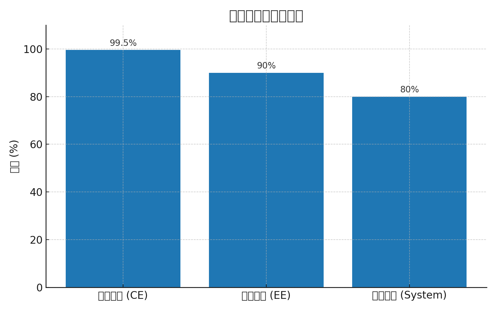

# 锂电池充电效率对比

锂电池在充放电过程中，常用的效率指标主要有三类：

## 1. 库伦效率 (Coulombic Efficiency, CE)
- **定义**：充电过程中输入的电荷量，与放电过程中释放的电荷量之比。
- **公式**：CE = Q放电 / Q充电 × 100%
- **典型值**：接近 100%（一般 >99%）。
- **意义**：反映副反应（如 SEI 膜生长、副产气体）的多少。

## 2. 能量效率 (Energy Efficiency, EE)
- **定义**：充电输入的能量，与放电输出的能量之比。
- **公式**：EE = E放电 / E充电 × 100%
- **典型值**：约 85% ~ 95%。
- **意义**：受充放电电压差和内阻影响，体现电池的能量利用率。

## 3. 系统效率 (System Efficiency)
- **定义**：整个储能系统的效率，包括电池本身、BMS、电源转换器、冷却系统等损耗。
- **公式**：System = P输出 / P输入 × 100%
- **典型值**：约 70% ~ 85%。
- **意义**：评估实际工程应用中的综合性能。

---

## 效率对比图

下图展示了三类效率的典型对比：

