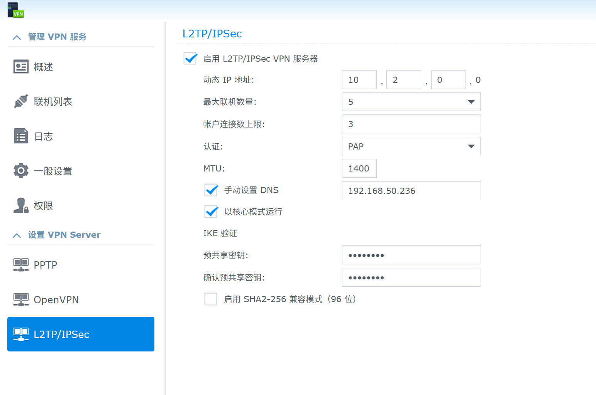
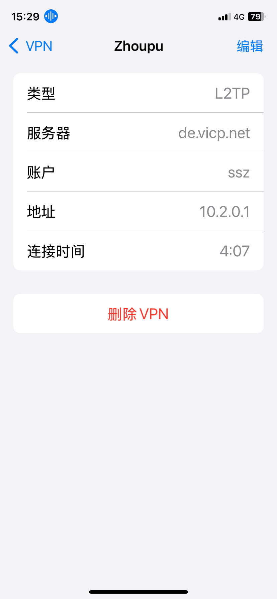
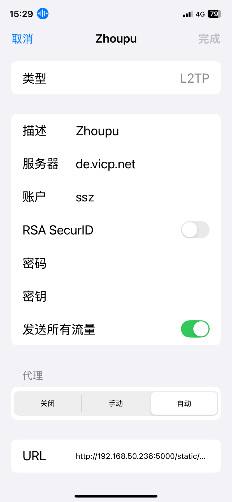

# 群晖VPN Server For L2TP/IPSEC
苹果手机用vpn, 不支持OpenVPN

## 群晖6.22配置
配置项目
- Overview

- 认证 PAP, 必须选它
- 手动设置DNS
- 以核心模式运行
- IKE 验证
    - 预共享密码,等同于IPhone上的密钥

## 群晖端Troubleshooting
排错
- 检查端口, 确认UDP可用
    - 500 IKE
    - 4500 NAT-T
    - 1701 L2TP
```
netstat -ano |grep -E '500|4500|1701'
```
- 检查日志
`tail -f /var/log/*log | grep -i l2tp`
    - 密钥不对
probable authentication failure (mismatch of preshared secrets?): malformed payload in packet


## 手机端配置
配置项目
- Overview


- 编辑页

    - 账户 群晖的登陆用户名
    - RSA SecurID, disabled
    - 密码 群晖的登陆密码
    - 密钥 群晖上配置的预共享密钥
    - 发送所用流量
    - URL 那些域名需要走vpn的配置页
`http://192.168.50.236:5000/static/proxy/gfwlist.pac`

## Iphone11端Troubleshooting
排错

- 局域网内无法访问vpn
Url必须要配置成`http://192.168.50.236:5000/static/proxy/gfwlist.pac, 不能用de.vicp.net作域名
