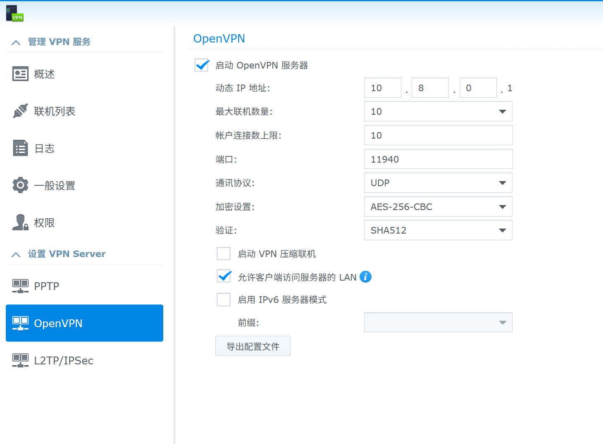

# 群晖VPN Server For Openvpn
Windows, linux用

## 群晖6.22配置
配置项目

- Overview

- 启动vpn压缩联机, disabled, 从openvpn3-client v3.7.2后就不支持comp-lzo压缩了
- 允许客户端访问服务器的LAN

## 群晖端Troubleshooting
排错

- 检查日志
`tail -f /var/log/*log | grep -i vpn`
